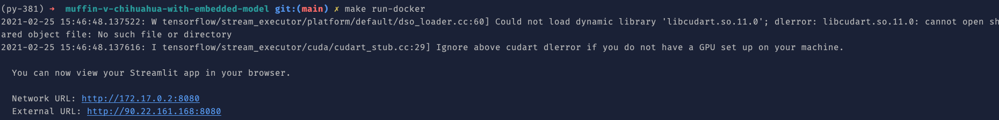
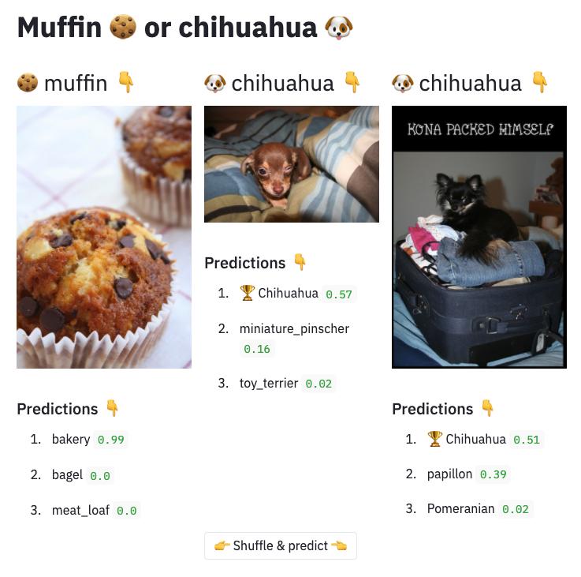

# muffin-v-chihuahua-with-embedded-model

This repo offers some code to illustrate the following blog article <http://link to come when published>.

It aims to demonstrate one way to package with Wheel and Docker a Machine Learning application able to classify muffins and chihuahua in an image. 

This way is described as the packaging of an ML application with **"an embedded model"** in the [Continuous Delivery for Machine Learning (CD4ML)](https://martinfowler.com/articles/cd4ml.html#ModelServing) article from Martin Fowler's blog. 


This app needs 

* a pre-trained Deep Learning model,
* some images of muffins and chihuahuas, for demonstration purposes,
* some Python code.

Packaging of this Python app is done with 

* the Wheel format, with setuptools 
* and docker.

## Demo with docker

You can test the end result with the following docker container :

```bash
    docker pull mho7/muffin-v-chihuahua-embedded:v1;
    docker run -p 8080:8080 mho7/muffin-v-chihuahua-embedded:v1;
```

The remaining parts of this README document explains how to build this `muffin-v-chihuahua-embedded` docker container. 

## How can I run the packaging of this muffin_v_chihuahua ML app

Basically, everything you can do in this repo is available when running `make` or `make help` in your terminal, according to the [self-documented makefile](https://marmelab.com/blog/2016/02/29/auto-documented-makefile.html) convention.


### Download some images

You can run `make datasets` at the root of this repo.

This command will populate the `muffin_v_chihuahua/data/chihuahua/` folder with a dataset of chihuahua images and `muffin_v_chihuahua/data/muffin/` with muffin images.

Those images are downloaded from <http://image-net.org/>.

### Download a pre-trained model

To avoid training an ad-hoc model for this computer vision task, we can download a pre-trained model with `make model`.

This command will download the InceptionV3 model [listed on Keras website](https://keras.io/api/applications/).

This model is downloaded from François Chollet [deep-learning-models](https://github.com/fchollet/deep-learning-models/) repository, in which the official InceptionV3 model is exposed as an artefact in [release v0.5](https://github.com/fchollet/deep-learning-models/releases/tag/v0.5).

### Package the application (with images and a model) as a Wheel

You can run `make package-wheel` to build a Wheel distribution from

* the [setup.py](./setup.py), [setup.cfg](./setup.cfg) and [MANIFEST.in](./MANIFEST.in) files,
* the Python sources in the [muffin_v_chihuahua](./muffin_v_chihuahua) package,
* the images of muffins and chihuahuas in [data/](./muffin_v_chihuahua/data) folder,
* the [ML pre-trained model](./muffin_v_chihuahua/inception_v3_weights_tf_dim_ordering_tf_kernels.h5) in the muffin_v_chihuahua package.

The result of this command will be the creation of a `dist/` folder containing the `*.whl` distribution.

### Package the application (with the Wheel) as a docker image

You can run `make package-docker` to build a Wheel distribution from

* the [dockerfile](./dockerfile) that describes the image,
* the [Wheel distribution](./dist/muffin_v_chihuahua_with_embedded_model-1.0-py3-none-any.whl) generated in the `dist/` folder

### Run the application as a docker container

You can run the application with docker by running the following command : `make run-demo`.

While the application is running in your terminal, you can open your browser at <http://localhost:8080> to access the Streamlit frontend.

It should look like the following :

- in your terminal 👇



- in your browser 👇



You can quit the application in your terminal with `Ctrl+c` when you are done.

### (Optional) Run the application from the Wheel, without docker

Once the Wheel distribution is produced with `make package-wheel`, you can install the `muffin_v_chihuahua` Python package locally, in a Python virtual environment, with the following command : `pip install dist/muffin_v_chihuahua_with_embedded_model-1.0-py3-none-any.whl`.

You can check that the app is available with `pip freeze | grep muffin`.

Then, the `muffin_v_chihuahua` application will be available locally with the command line, as described in [muffin_v_chihuahua/__main__.py](muffin_v_chihuahua/__main__.py) script.

You can run the muffin-v-chihuahua classification demo with the following command : `muffin-v-chihuahua-with-embedded-model run-demo`.
